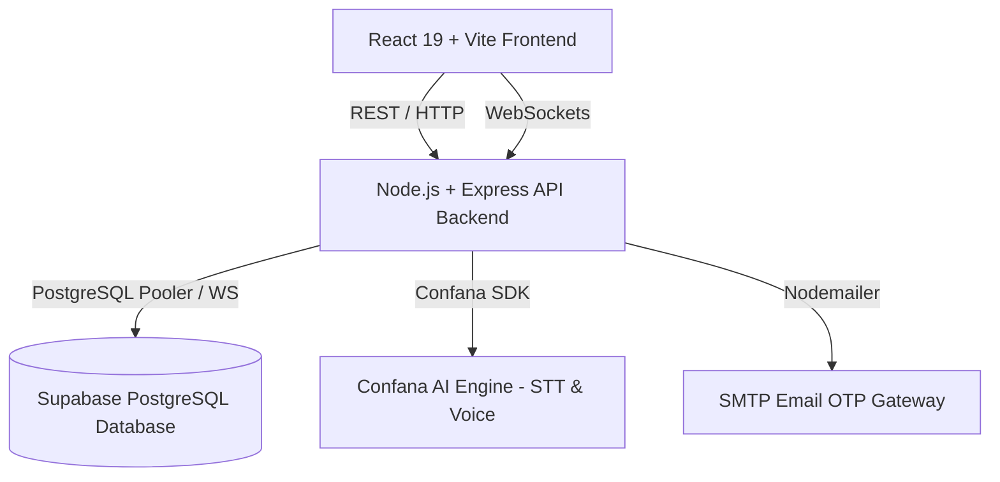

# 👁️ OptiFlow - UCC Eye Clinic Management & Tele-Optometry Platform

[](https://react.dev/)
[](https://vitejs.dev/)
[](https://tailwindcss.com/)
[](https://nodejs.org/)
[](https://supabase.com/)
[](LICENSE)

**OptiFlow** is an enterprise-grade clinical workflow and tele-optometry platform engineered specifically for the **University of Cape Coast (UCC) Eye Clinic**. Designed to serve both the **Main Campus** and **Old Site Annex**, OptiFlow streamlines patient intake, intelligent appointment scheduling, real-time queue management, multi-role clinical collaboration, interactive consultation analytics, and voice-assisted translations.

---

## 🚀 Key Features

### 👨‍🎓 1. Patient Portal
- **Location-Aware Booking**: Book appointments seamlessly for either **Main Campus** or **Old Site Annex**.
- **Fixed Daily Capacity**: Time slots operate strictly between **8:00 AM – 4:00 PM** (no bookings allowed past 3:00 PM), enforcing fixed slot quotas (9 patients per doctor daily limit).
- **Interactive Patient Dossier**: Real-time view of onboarding details, calculated age, occupation breakdown, and clinical visit history.
- **Queue & Status Tracking**: Live dashboard status updates (`Pending`, `In Progress`, `Done`, `Cancelled`) with automated notification alerts.
- **Doctor Rating & Feedback**: Rate attending doctors (1–5 stars) and write clinical reviews after consultation completion.
- **Campus Navigation Tour**: Interactive multi-waypoint navigation route maps leading patients directly from major campus landmarks (e.g. Sam Jonah Library, Main Gate, Valco Hall) to the clinic.

### 🩺 2. Doctor Portal
- **Live Active Patient Tracker**: Real-time indication when a scheduled patient is actively being seen by the doctor.
- **Consultation Stopwatch**: Automatic tracking of precise time spent on each patient consultation session.
- **Patient Dossier & History**: Quick access to comprehensive patient medical history, previous diagnoses, visual acuity metrics, and pre-exam vitals.
- **One-Click Completion**: Mark patient as "Done", instantly notifying the admin queue and enabling post-visit feedback for the patient.
- **Doctor Analytics Dashboard**: Visual charts powered by canvas rendering:
  - Total patients attended & average consultation duration.
  - Case distribution (e.g. Refractive Errors, Glaucoma screening, Conjunctivitis).
  - Diagnostic outcomes (e.g., *Prescribed Glasses*, *Referred to Specialist*, *Medication Dispensed*).
  - Patient satisfaction & review score ratings.

### 🛠️ 3. Clinic Admin Portal
- **Multi-Location Queue Dashboard**: Unified overview of active appointments across Main Campus and Old Site Annex.
- **Location-Based Doctor Assignment**: Assign incoming patient bookings to available doctors filtered specifically by clinic location.
- **Slot Capacity Management**: Open or close time slots dynamically with optional closure reasons (e.g. Staff Meeting, Equipment Maintenance). Closing a slot automatically sends real-time dashboard notifications to affected patients.
- **Quota Enforcer**: Ensures doctors do not exceed the daily cap of 9 patients.

### 👑 4. Super Admin Portal
- **System Overview**: High-level telemetry on total patients, appointments, revenue, and active staff.
- **Staff Management**: Onboard, assign locations, update roles (`Admin`, `Doctor`, `Assistant`, `Super Admin`), or decommission staff accounts across the institution.

### 📋 5. Assistant & Clinical Staff Portal
- **Pre-Examination Vitals**: Log preliminary diagnostic metrics including Visual Acuity (Left/Right eye), Intraocular Pressure (IOP), and primary patient complaints before the doctor consultation.
- **Activity Logs**: Track assistant activity history and link preliminary findings directly to patient dossiers.

### 🎙️ 6. Voice Translation AI Studio
- **Real-Time Speech-to-Text (STT)**: Integrated streaming ASR for voice-driven clinical note-taking.
- **Voice Translation**: Low-latency multi-lingual translation between local languages (e.g., Twi, Fante) and English to ensure friction-free patient-practitioner communication.
- **Text-to-Speech (TTS)**: Speech synthesis for auditory prescription guidelines and instructions.

---

## 🏗️ Architecture & Technology Stack



### **Frontend**
- **Framework**: React 19 + Vite 8
- **Styling**: TailwindCSS v4
- **Icons**: Lucide React
- **State & Routing**: Component-driven architecture with context-based auth and notification providers.

### **Backend**
- **Runtime**: Node.js ES Modules + Express 4
- **Real-time Communication**: Native WebSockets (`ws`) for live STT audio streaming and agent voice sessions.
- **Database Client**: `pg` (PostgreSQL client) with Supabase connection pooling & `@supabase/supabase-js`.
- **Authentication**: Email OTP verification via Nodemailer + Supabase Auth.
- **AI Integration**: `@dexel-confana/confana-dev` SDK for voice recognition and translation.

---

## 📁 Repository Structure

```text
OptiFlow/
├── backend/
│   ├── db/
│   │   ├── migrate.js        # Automated schema & seed migration runner
│   │   ├── schema.sql        # Database tables, triggers, and constraints
│   │   └── seed.sql          # Seed data (capacity slots, campus locations, demo users)
│   ├── src/
│   │   ├── config/           # Database & Confana SDK configurations
│   │   ├── controllers/      # Auth, capacity, appointment, review, voice controllers
│   │   ├── routes/           # API endpoints routing definitions
│   │   ├── utils/            # Helper utilities (Email OTP, token generation)
│   │   └── server.js         # Main Express & WebSocket server initialization
│   ├── .env.example          # Environment variables template
│   └── package.json
│
├── frontend/
│   ├── public/               # Static assets & favicon
│   ├── src/
│   │   ├── assets/           # UI media & brand logos
│   │   ├── components/       # Dossier modals, analytics charts, custom selects, notifications
│   │   ├── context/          # Global application state contexts
│   │   ├── lib/              # Supabase & API utility clients
│   │   ├── pages/            # Multi-portal dashboards (Student, Doctor, Admin, Voice AI)
│   │   ├── App.jsx           # Root router & layout configuration
│   │   └── main.jsx          # React app entry point
│   └── package.json
│
├── info.txt                  # Project requirements & specifications
├── .gitignore                # Root Git ignore rules
└── README.md                 # System documentation
```

---

## ⚡ Getting Started

### Prerequisites
- **Node.js**: `v18.x` or higher
- **npm** or **pnpm**
- **PostgreSQL Database** (or a free [Supabase](https://supabase.com/) project)

---

### 📦 1. Backend Setup

1. Navigate to the backend directory:
   ```bash
   cd backend
   ```

2. Install dependencies:
   ```bash
   npm install
   ```

3. Configure Environment Variables:
   Create a `.env` file inside `backend/` using `.env.example` as a reference:
   ```bash
   cp .env.example .env
   ```
   Fill in your PostgreSQL `DATABASE_URL`, Supabase API keys, and Email credentials:
   ```env
   PORT=5000
   DATABASE_URL=postgresql://<user>:<password>@<host>:6543/postgres
   SUPABASE_URL=https://<your-project>.supabase.co
   SUPABASE_ANON_KEY=<your-anon-key>
   SUPABASE_SERVICE_ROLE_KEY=<your-service-role-key>
   EMAIL_USER=your-email@gmail.com
   EMAIL_PASS=your-gmail-app-password
   ```

4. Run Database Migration & Seeding:
   ```bash
   npm run db:migrate
   ```

5. Start Backend Server:
   ```bash
   npm run dev
   ```
   The backend will start running on **`http://localhost:5000`**.

---

### 💻 2. Frontend Setup

1. Open a new terminal and navigate to the frontend directory:
   ```bash
   cd frontend
   ```

2. Install dependencies:
   ```bash
   npm install
   ```

3. Start Vite Development Server:
   ```bash
   npm run dev
   ```
   The frontend application will be live at **`http://localhost:5173`**.

---

## 🔑 Demo Login Credentials

The database migration automatically seeds standard test accounts for rapid testing:

| Role | Email | Default Password | Location |
| :--- | :--- | :--- | :--- |
| **Clinic Admin** | `admin@gmail.com` | `Test` | Main Campus |
| **Doctor (Main Campus)** | `prince@gmail.com` | `Test` | Main Campus |
| **Doctor (Main Campus)** | `sarah@gmail.com` | `Test` | Main Campus |
| **Doctor (Main Campus)** | `emmanuel@gmail.com` | `Test` | Main Campus |
| **Doctor (Old Site)** | `maxwell@gmail.com` | `Test` | Old Site Annex |
| **Doctor (Old Site)** | `grace@gmail.com` | `Test` | Old Site Annex |
| **Doctor (Old Site)** | `daniel@gmail.com` | `Test` | Old Site Annex |
| **Patient / Student** | *(Self Sign-up with OTP)* | Custom | Main / Old Site |

---

## 🌐 API & WebSocket Reference

### Core REST Endpoints

| Method | Endpoint | Description |
| :--- | :--- | :--- |
| `POST` | `/api/auth/login` | Authenticate user & retrieve profile |
| `POST` | `/api/auth/send-otp` | Send email verification OTP code |
| `POST` | `/api/auth/verify-otp` | Verify OTP code & complete student registration |
| `GET` | `/api/capacity` | Fetch available clinic capacity time slots |
| `POST` | `/api/appointments` | Book new eye clinic appointment |
| `GET` | `/api/appointments/doctor/:doctorId` | Retrieve queue for specific doctor |
| `PATCH` | `/api/appointments/:id/start` | Start consultation (starts live timer) |
| `PATCH` | `/api/appointments/:id/complete` | Complete consultation & record outcomes |
| `GET` | `/api/appointments/doctor/:doctorId/analytics` | Fetch clinical case analytics & metrics |
| `POST` | `/api/reviews` | Submit patient doctor rating & review |

### WebSockets

- **Agent Voice Session**: `ws://localhost:5000/api/agent-session?agentId=<AGENT_ID>`
- **Real-Time STT Stream**: `ws://localhost:5000/api/stt-stream?language=en`

---

## 📄 License

This project is licensed under the **MIT License** - see the LICENSE file for details.

---

## 🤝 Acknowledgments & Authors
Developed for **University of Cape Coast (UCC) Eye Clinic** to modernize optometry services across campus.

- **Developer**: Prince Annan ([@princeannan4332](https://github.com/princeannan4332))
