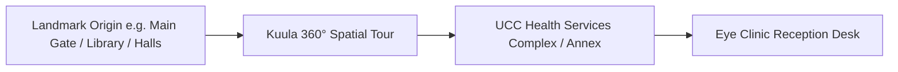
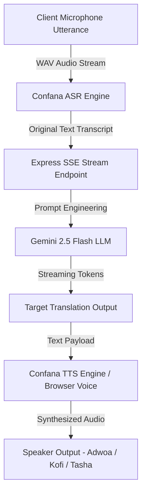
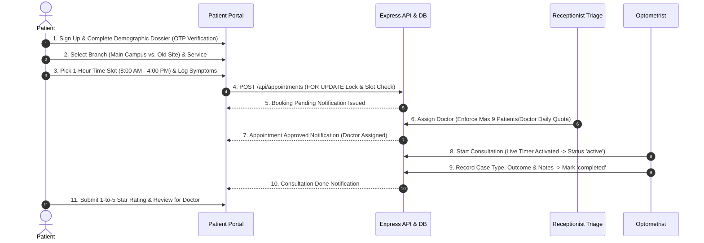
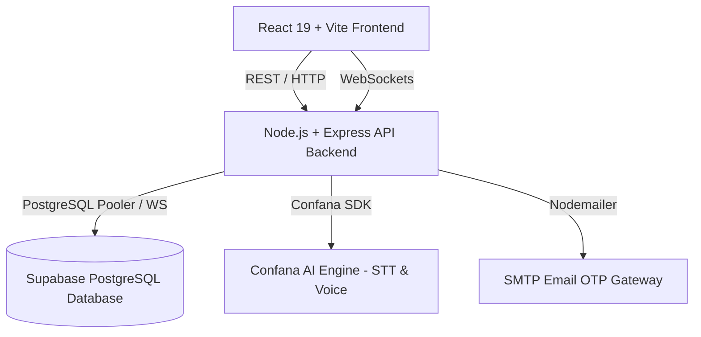

# 👁️ OptiFlow - UCC Eye Clinic Management & Tele-Optometry Platform

[](https://react.dev/)
[](https://vitejs.dev/)
[](https://tailwindcss.com/)
[](https://nodejs.org/)
[](https://supabase.com/)
[](LICENSE)

**OptiFlow** is an enterprise-grade clinical workflow and tele-optometry platform engineered specifically for the **University of Cape Coast (UCC) Eye Clinic**. Designed to serve both the **Main Campus** and **Old Site Annex**, OptiFlow streamlines patient intake, intelligent appointment scheduling, real-time queue management, multi-role clinical collaboration, interactive consultation analytics, and voice-assisted translations.

---

## 👥 System User Roles & Detailed Responsibilities

The OptiFlow ecosystem is built around 5 specialized user roles, ensuring smooth communication and clear division of responsibilities across the entire clinic workflow:

### 👨‍🎓 1. Patient / Student Portal
- **Target Users**: UCC Students, Staff, Faculty, and General Public Patients.
- **Detailed Responsibilities & Features**:
  - **Account Registration & OTP Verification**: Sign up using a verified email address with OTP security codes. Patients fill out complete profile information including contact numbers and occupation (e.g., *Student*, *Lecturer*, *Trader*, *Civil Servant*).
  - **Location-Aware Appointment Booking**: Choose between treatment at **Main Campus Clinic** or **Old Site Annex**.
  - **Smart Time-Slot Booking**: Select 1-hour time slots operating strictly between **8:00 AM and 4:00 PM**. Bookings automatically close at **3:00 PM** to allow doctors to finish consultations by 4:00 PM.
  - **Real-Time Queue & Status Tracking**: Monitor live appointment status on the dashboard (`Pending`, `Assigned`, `In Progress`, `Done`, or `Cancelled`).
  - **Instant Dashboard Notifications**: Receive automated push notifications when a receptionist assigns a doctor, when consultation starts/ends, or if a slot is closed by the clinic with an explanation.
  - **Patient Medical Dossier & History**: View personal onboarding data, calculated current age (computed from date of birth), and historical diagnosis records from past clinic visits.
  - **Doctor Rating & Review Submission**: After the doctor completes a consultation, patients unlock the ability to leave a 1-to-5 star rating and detailed written feedback on their care experience.
  - **Turn-by-Turn Campus Navigation Tour**: Interactive visual guide providing step-by-step route directions from 9 major UCC landmarks (Main Gate, Sam Jonah Library, Valco Hall, Casford Hall, Adehye Hall) straight to the Eye Clinic reception desk.

---

### 🛎️ 2. Receptionist Portal *(Front Desk Administration)*
- **Target Users**: Clinic Receptionists, Front-Desk Operations Staff, and Triage Administrators.
- **Detailed Responsibilities & Features**:
  - **Centralized Multi-Branch Queue Management**: Monitor all incoming patient check-ins and appointments across both Main Campus and Old Site Annex in real time.
  - **Location-Based Doctor Assignment**: Match incoming unassigned patient bookings to available optometrists based strictly on the selected clinic branch (Main Campus vs. Old Site).
  - **Doctor Daily Workload Quota Enforcement**: Monitor each doctor's daily assigned count to enforce the strict policy limit of **9 patients per doctor per day**, preventing practitioner burnout and ensuring quality patient care.
  - **Capacity Slot Management**: Open, modify, or close hourly time slots (8:00 AM – 4:00 PM) based on clinic operations.
  - **Slot Closure & Automated Patient Alerting**: When closing a slot (e.g. for staff meetings or emergency closures), receptionists can provide an optional closure reason. The system automatically cancels affected bookings and sends instant dashboard notification alerts to impacted patients.
  - **Live Patient Dossier Access**: View complete patient demographic info, calculated age, contact numbers, and occupation during physical check-in at the front desk.

---

### 🩺 3. Doctor / Optometrist Portal
- **Target Users**: Licensed Optometrists, Ophthalmologists, and Resident Doctors.
- **Detailed Responsibilities & Features**:
  - **Assigned Consultation Queue**: View today's patient queue assigned specifically to them by receptionists, filtered by location.
  - **Patient Dossier & Medical History**: Review patient age, occupation, past visual acuity readings, historical diagnoses, and clinical notes prior to calling the patient in.
  - **Pre-Examination Triage Vitals**: Inspect preliminary diagnostic data (Visual Acuity L/R, Intraocular Pressure IOP, Chief Complaint) recorded by Clinical Assistants.
  - **Live Consultation Stopwatch**: Clicking **"Start Consultation"** initiates an automatic timer that tracks exact time spent with the active patient.
  - **Real-Time Active Patient Status**: Updating a patient to *In Progress* immediately reflects on the Receptionist Dashboard so the front desk knows which patient is currently in the consultation room.
  - **Clinical Outcome Recording**: Document case types (e.g., *Refractive Errors*, *Glaucoma*, *Cataracts*, *Conjunctivitis*) and outcomes (e.g., *Prescribed Glasses*, *Medication Dispensed*, *Referred to Specialist*).
  - **Marking Patients "Done"**: Marking a patient as complete updates the Receptionist dashboard, stops the consultation timer, and enables post-consultation review submission on the patient portal.
  - **Automated Daily Queue Reset**: The doctor's active daily consultation dashboard automatically clears after 24 hours (overnight) to start fresh for the next clinical day.
  - **Doctor Analytics Dashboard**: Interactive visual charts rendering:
    - Total patients attended per day/week/month.
    - Average consultation duration per patient.
    - Case type distribution pie/bar charts.
    - Outcome ratios (referrals vs prescriptions).
    - Overall patient review ratings and feedback breakdown.

---

### 📋 4. Clinical Assistant / Doctor Assistant Portal
- **Target Users**: Ophthalmic Nurses, Optometry Interns, and Clinical Triage Assistants.
- **Detailed Responsibilities & Features**:
  - **Pre-Examination Triage & Vitals Logging**: Measure and record essential preliminary eye metrics before the doctor consultation, including Visual Acuity (e.g., `6/6`, `6/12`), Intraocular Pressure (`IOP in mmHg`), and primary patient complaints.
  - **Activity & Clinical Logging**: Log daily triage activities and attach findings directly to the patient's digital dossier.
  - **Doctor Collaboration**: Assist assigned optometrists by preparing patient charts and ensuring patient readiness in exam rooms.

---

### 👑 5. Super Administrator Portal
- **Target Users**: Eye Clinic Directors, IT Administrators, and Executive Management.
- **Detailed Responsibilities & Features**:
  - **Institutional Telemetry Overview**: High-level metrics monitoring total registered patients, overall system appointment counts, active staff members, and location performance.
  - **Staff Governance & Onboarding**: Create, edit, role-update (`Receptionist`, `Doctor`, `Clinical Assistant`, `Super Admin`), and delete staff accounts across the entire organization.
  - **Branch Location Allocation**: Assign new doctors and staff to their designated primary operating location (Main Campus vs Old Site Annex).
  - **Doctor-Assistant Pairings**: Assign or reassign clinical assistants to work directly under specific doctors.

---

## 🗺️ Deep Dive: 3D Campus Virtual Navigation Tour using Kuula

The **OptiFlow 3D Navigation Tour** addresses campus wayfinding challenges at the University of Cape Coast (UCC). Built using embedded **Kuula 360° WebGL/HTML5 spatial panoramas**, the navigation suite allows patients, students, staff, and international visitors to visually explore campus routes and locate the Eye Clinic prior to their scheduled appointment.



### 📍 Multi-Branch Campus Coverage
The navigation page ([NavigationTourPage.jsx](file:///b:/projects/new%20projects%20from%20laptop/React%20js/OptiFlow/frontend/src/pages/NavigationTourPage.jsx)) provides dedicated interactive virtual tours for both UCC clinic branches:

| Campus Location | Target Facility | GPS Coordinates | Kuula Collection Embed URL | Viewport Height |
| :--- | :--- | :--- | :--- | :--- |
| **Main Campus** | UCC Health Services Complex, Eye Clinic Unit | `5.1054° N, 1.2821° W` | `https://kuula.co/share/collection/7TMFG` | 560px |
| **Old Site Annex** | UCC Old Site Campus Complex | `5.1012° N, 1.2875° W` | `https://kuula.co/share/collection/7TgVY` | 500px |

### 🛠️ Key Technical & Interactive Features
- **Responsive WebGL / HTML5 Canvas iFrames**: Embedded using secure `allow="xr-spatial-tracking; gyroscope; accelerometer"` permissions to enable motion-based panoramic controls on mobile phones and tablets.
- **Landmark-to-Clinic Wayfinding Routes**: Step-by-step navigational guidance connecting 9 major UCC campus landmarks straight to the Eye Clinic reception desk:
  1. *Main Gate Entrance*
  2. *Sam Jonah Library*
  3. *Valco Hall*
  4. *Casford Hall*
  5. *Adehye Hall*
  6. *Kwame Nkrumah Hall*
  7. *Oguaa Hall*
  8. *Faculty of Education Lecture Theatre (FELT)*
  9. *Amissah Arthur Language Center*
- **Panoramic Controls & Sensor Fusion**: Users can rotate 360 degrees horizontally and vertically, zoom into directional signage, open location thumbnail grids, toggle fullscreen mode, or use device gyroscopes for spatial orientation.
- **Instant Location Switching**: Seamless tab selector allows patients to toggle between Main Campus and Old Site Annex wayfinding views without reloading the page.

---

## 🎙️ Deep Dive: Multilingual Voice Translation AI Suite & Confana Neural Pipeline

Communication barriers between clinicians and local non-English speaking patients can impair diagnostic accuracy. OptiFlow integrates a **Multilingual Voice AI Studio** powered by the **Confana SDK** (`@dexel-confana/confana-dev`) and **Google Gemini 2.5 Flash**, enabling real-time voice-to-voice translation, zero-shot voice cloning, continuous speech-to-text dictation, and conversational voice assistance.



### 🎙️ 4 Core Operating Modes ([VoiceTranslationPage.jsx](file:///b:/projects/new%20projects%20from%20laptop/React%20js/OptiFlow/frontend/src/pages/VoiceTranslationPage.jsx))

#### 1. Real-Time Speech-to-Speech Translation
- **Audio Capture & ASR Transcription**: Captured live via Web Audio API (`startWavRecording`), producing standard WAV audio blobs sent to `/api/translate/audio`. The backend invokes `confanaClient.asr.transcribeBytes()` to convert audio into text.
- **Gemini 2.5 Flash SSE Stream**: Translates text via Server-Sent Events (`/api/translate/stream`). The prompt is engineered specifically for clinical dialogue (interpreting eye symptoms like itching, blurred vision, or IOP checkups while preserving natural phrasing).
- **Multilingual Support**: Supports low-latency translation between English, local Ghanaian languages (**Akan / Twi / Fante**, **Ewe**, **Ga**), and global languages (**French**, **Spanish**, **German**, **Italian**, **Chinese**, **Japanese**).
- **TTS Auditory Output**: Synthesizes output speech using `confanaClient.tts.speak()` with voice speaker profiles, with fallback to Web Speech API `SpeechSynthesis`.

#### 2. Zero-Shot Voice Cloning & TTS Sandbox
- **Custom Voice Profiles**: Synthesizes clinical instructions or prescription guidelines in specific voice personas (**Adwoa**, **Kofi**, **Tasha**, **Bob**).
- **Reference Audio Upload**: Users can upload a reference voice recording (`.wav` or `.mp3`) to clone clinician voices for patient instructions.

#### 3. Continuous Streaming Speech-to-Text (STT)
- **Hands-Free Dictation**: Allows optometrists to speak naturally during examinations while the app streams real-time text snippets directly into clinical record fields.

#### 4. Interactive Clinical Voice Agent Sandbox
- **WebSocket AI Session**: Connects to `ws://localhost:5000/api/agent-session?agentId=optiflow-optometry-ai` for interactive voice triage and appointment assistance.

---

## 📅 Deep Dive: Step-by-Step Patient Appointment Booking & Consultation Workflow

OptiFlow enforces a structured, multi-stage clinical lifecycle from patient intake to post-consultation reviews, guarded by PostgreSQL database transactions and row-level locking.



### 📋 Detailed Step-by-Step Breakdown

#### Step 1: Patient Account Registration & Verified Profile Onboarding
- **Email Verification**: Patients sign up using email and verify using an OTP code sent via Nodemailer.
- **Demographic Dossier**: Onboarding requires capturing full name, email, phone number, gender, date of birth (from which age is calculated), occupation (*Student*, *Lecturer*, *Trader*, *Civil Servant*, etc.), medical conditions, allergies, and emergency contact details ([OnboardingPage.jsx](file:///b:/projects/new%20projects%20from%20laptop/React%20js/OptiFlow/frontend/src/pages/OnboardingPage.jsx)).

#### Step 2: Clinic Location Selection
- Patients choose between **Main Campus (Health Services Center)** and **Old Site Clinic Annex**. This selection filters available time slots specifically created for that facility.

#### Step 3: Clinical Service Requirement Selection
- Patients select the specific service needed:
  - *General Eye Examination*
  - *Refraction & Visual Acuity Test*
  - *Glaucoma Screening & IOP*
  - *Frame & Lens Fitting*
  - *Contact Lens Consultation*
  - *Red Eye / Infection Evaluation*

#### Step 4: Time Slot Selection & Database Concurrency Locking
- **Operating Hours Policy**: Time slots operate between **8:00 AM and 4:00 PM**. Booking closes at **3:00 PM** to ensure clinicians finish all visits by 4:00 PM.
- **Atomic Locking (`FOR UPDATE`)**: The backend (`createAppointment` in [appointmentController.js](file:///b:/projects/new%20projects%20from%20laptop/React%20js/OptiFlow/backend/src/controllers/appointmentController.js)) queries `clinic_capacity` with SQL row locking (`FOR UPDATE`). It checks that `booked_slots < max_slots`, increments `booked_slots`, and inserts the appointment record inside a single database transaction (`BEGIN...COMMIT`).

#### Step 5: Structured Symptom & Clinical Complaint Logging
- Patients provide structured complaint details:
  - **Primary Complaint**: Blurry vision, eye strain, itching/redness, frequent headaches, glaucoma history, double vision, red eye infection.
  - **Duration**: `< 3 Days`, `1 - 2 Weeks`, `3 - 4 Weeks`, `> 1 Month`.
  - **Severity**: `Mild`, `Moderate`, `Severe`.
  - **Additional Notes**: Open text for patient history.

#### Step 6: Confirmation & Instant Alert Notification
- The appointment is created with `pending` status. An instant alert notification is saved to the `notifications` table and displayed on the patient's alert feed.

#### Step 7: Front-Desk Receptionist Triage & Location-Based Doctor Allocation
- Front-desk staff inspect the queue on the Receptionist Dashboard.
- **Doctor Daily Quota Enforcement**: When approving an appointment and assigning a doctor, the backend checks that the doctor hasn't exceeded the policy limit of **9 patients per doctor per day** (`status IN ('approved', 'active', 'completed')`). If the cap is reached, assignment is blocked.
- **Approval Notification**: Upon approval, an instant notification is dispatched to the patient detailing their assigned doctor and location.

#### Step 8: Clinical Triage, Live Consultation Stopwatch & Outcomes
- **Assistant Pre-Triage**: Clinical Assistants log preliminary vitals (Visual Acuity L/R, Intraocular Pressure IOP in mmHg).
- **Live Consultation Timer**: Clicking **"Start Consultation"** (`PATCH /api/appointments/:id/start`) sets status to `active`, records `consultation_start_time`, and starts a live timer. The active state reflects across front-desk and patient dashboards in real time.
- **Outcome & Notes Recording**: The doctor selects case classification (e.g. *Refractive Errors*, *Glaucoma*, *Cataracts*, *Conjunctivitis*), case outcome (e.g. *Prescribed Glasses*, *Medication Dispensed*, *Referred to Specialist*), inputs clinical notes, and clicks **"Complete Consultation"** (`PATCH /api/appointments/:id/complete`). Duration in minutes is automatically computed.

#### Step 9: Post-Consultation Doctor Rating & Review
- Marking an appointment as `completed` unlocks the **Rate & Review Doctor** button on the patient dashboard.
- Patients submit a **1-to-5 star rating** and detailed feedback ([reviewController.js](file:///b:/projects/new%20projects%20from%20laptop/React%20js/OptiFlow/backend/src/controllers/reviewController.js)), which feeds into the doctor's performance analytics dashboard.

---

## 🏗️ Architecture & Technology Stack



### **Frontend**
- **Framework**: React 19 + Vite 8
- **Styling**: TailwindCSS v4
- **Icons**: Lucide React
- **State & Routing**: Component-driven architecture with context-based auth and notification providers.

### **Backend**
- **Runtime**: Node.js ES Modules + Express 4
- **Real-time Communication**: Native WebSockets (`ws`) for live STT audio streaming and agent voice sessions.
- **Database Client**: `pg` (PostgreSQL client) with Supabase connection pooling & `@supabase/supabase-js`.
- **Authentication**: Email OTP verification via Nodemailer + Supabase Auth.
- **AI Integration**: `@dexel-confana/confana-dev` SDK for voice recognition and translation.

---

## 📁 Repository Structure

```text
OptiFlow/
├── backend/
│   ├── db/
│   │   ├── migrate.js        # Automated schema & seed migration runner
│   │   ├── schema.sql        # Database tables, triggers, and constraints
│   │   └── seed.sql          # Seed data (capacity slots, campus locations, demo users)
│   ├── src/
│   │   ├── config/           # Database & Confana SDK configurations
│   │   ├── controllers/      # Auth, capacity, appointment, review, voice controllers
│   │   ├── routes/           # API endpoints routing definitions
│   │   ├── utils/            # Helper utilities (Email OTP, token generation)
│   │   └── server.js         # Main Express & WebSocket server initialization
│   ├── .env.example          # Environment variables template
│   └── package.json
│
├── frontend/
│   ├── public/               # Static assets & favicon
│   ├── src/
│   │   ├── assets/           # UI media & brand logos
│   │   ├── components/       # Dossier modals, analytics charts, custom selects, notifications
│   │   ├── context/          # Global application state contexts
│   │   ├── lib/              # Supabase & API utility clients
│   │   ├── pages/            # Multi-portal dashboards (Student, Doctor, Receptionist, Voice AI)
│   │   ├── App.jsx           # Root router & layout configuration
│   │   └── main.jsx          # React app entry point
│   └── package.json
│
├── info.txt                  # Project requirements & specifications
├── .gitignore                # Root Git ignore rules
└── README.md                 # System documentation
```

---

## ⚡ Getting Started

### Prerequisites
- **Node.js**: `v18.x` or higher
- **npm** or **pnpm**
- **PostgreSQL Database** (or a free [Supabase](https://supabase.com/) project)

---

### 📦 1. Backend Setup

1. Navigate to the backend directory:
   ```bash
   cd backend
   ```

2. Install dependencies:
   ```bash
   npm install
   ```

3. Configure Environment Variables:
   Create a `.env` file inside `backend/` using `.env.example` as a reference:
   ```bash
   cp .env.example .env
   ```
   Fill in your PostgreSQL `DATABASE_URL`, Supabase API keys, and Email credentials:
   ```env
   PORT=5000
   DATABASE_URL=postgresql://<user>:<password>@<host>:6543/postgres
   SUPABASE_URL=https://<your-project>.supabase.co
   SUPABASE_ANON_KEY=<your-anon-key>
   SUPABASE_SERVICE_ROLE_KEY=<your-service-role-key>
   EMAIL_USER=your-email@gmail.com
   EMAIL_PASS=your-gmail-app-password
   ```

4. Run Database Migration & Seeding:
   ```bash
   npm run db:migrate
   ```

5. Start Backend Server:
   ```bash
   npm run dev
   ```
   The backend will start running on **`http://localhost:5000`**.

---

### 💻 2. Frontend Setup

1. Open a new terminal and navigate to the frontend directory:
   ```bash
   cd frontend
   ```

2. Install dependencies:
   ```bash
   npm install
   ```

3. Start Vite Development Server:
   ```bash
   npm run dev
   ```
   The frontend application will be live at **`http://localhost:5173`**.

---

## 🔑 Demo Login Credentials

The database migration automatically seeds standard test accounts for rapid testing:

| Role | Email | Default Password | Location |
| :--- | :--- | :--- | :--- |
| **Receptionist** | `admin@gmail.com` | `Test` | Main Campus |
| **Doctor (Main Campus)** | `prince@gmail.com` | `Test` | Main Campus |
| **Doctor (Main Campus)** | `sarah@gmail.com` | `Test` | Main Campus |
| **Doctor (Main Campus)** | `emmanuel@gmail.com` | `Test` | Main Campus |
| **Doctor (Old Site)** | `maxwell@gmail.com` | `Test` | Old Site Annex |
| **Doctor (Old Site)** | `grace@gmail.com` | `Test` | Old Site Annex |
| **Doctor (Old Site)** | `daniel@gmail.com` | `Test` | Old Site Annex |
| **Patient / Student** | *(Self Sign-up with OTP)* | Custom | Main / Old Site |

---

## 🌐 API & WebSocket Reference

### Core REST Endpoints

| Method | Endpoint | Description |
| :--- | :--- | :--- |
| `POST` | `/api/auth/login` | Authenticate user & retrieve profile |
| `POST` | `/api/auth/send-otp` | Send email verification OTP code |
| `POST` | `/api/auth/verify-otp` | Verify OTP code & complete student registration |
| `GET` | `/api/capacity` | Fetch available clinic capacity time slots |
| `POST` | `/api/appointments` | Book new eye clinic appointment |
| `GET` | `/api/appointments/doctor/:doctorId` | Retrieve queue for specific doctor |
| `PATCH` | `/api/appointments/:id/start` | Start consultation (starts live timer) |
| `PATCH` | `/api/appointments/:id/complete` | Complete consultation & record outcomes |
| `GET` | `/api/appointments/doctor/:doctorId/analytics` | Fetch clinical case analytics & metrics |
| `POST` | `/api/reviews` | Submit patient doctor rating & review |

### WebSockets

- **Agent Voice Session**: `ws://localhost:5000/api/agent-session?agentId=<AGENT_ID>`
- **Real-Time STT Stream**: `ws://localhost:5000/api/stt-stream?language=en`

---

## 📄 License

This project is licensed under the **MIT License** - see the LICENSE file for details.

---

## 🤝 Acknowledgments & Contributors
Developed for **University of Cape Coast (UCC) Eye Clinic** to modernize optometry services across campus.

- **Lead Developer**: Prince Annan ([@princeannan4332](https://github.com/princeannan4332))
- **Contributors**:
  - Rachel Mantey
  - Esther Korankye
